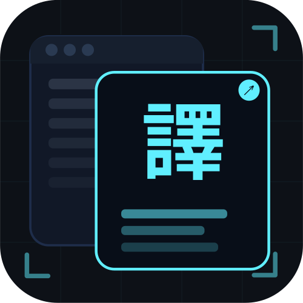
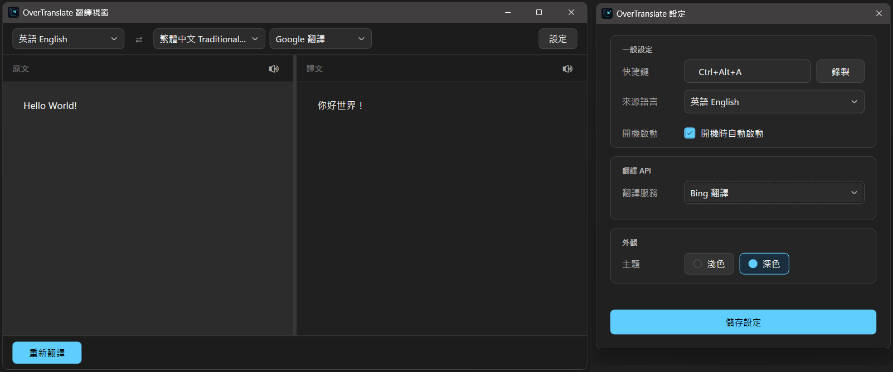

  

  <h1>OverTranslate</h1>

  
框選畫面、OCR 辨識、譯文原位覆蓋的 Windows 螢幕即時翻譯工具

  

    <a href="https://github.com/asd880921/OverTranslate/releases/latest/download/OverTranslate-win-Setup.exe">
      <strong>📥 點擊下載最新版 Windows 安裝檔</strong>
    </a>
  

  

    
  

  

    
    
  

---

## 這是什麼？

**OverTranslate** 是一款專為 Windows 打造的即時螢幕翻譯工具。

只需按下快捷鍵並框選畫面，即可將翻譯結果直接顯示在原位置。無論是遊戲、PDF、影片字幕或無法選取的文字，都能輕鬆翻譯，讓閱讀不中斷。

### 特色

- 🆓 **免費、免 API Key** — 內建多家翻譯服務
- 🎯 **原位覆蓋** — 譯文直接疊加於原文位置，閱讀不中斷
- 🔁 **多引擎自動備援** — 首選引擎未能即時回應時自動切換，提升穩定性
- 🔒 **資料安全** — OCR 完全在本機運行，僅辨識結果會傳送至翻譯服務
---

## 翻譯視窗

除覆蓋模式外，亦提供獨立翻譯視窗：即時同步翻譯輸入內容，支援來源與目標語言互換，並可朗讀原文或譯文。

## 翻譯 API

內建多種翻譯來源，均免費、無需 API Key。
| 服務 | 說明 |
|------|------|
| Google 翻譯（RPC） | 預設，速度與翻譯品質兼顧 |
| Google 翻譯（Web） | 傳統 API，回應快 |
| Bing 翻譯 | 翻譯品質最佳 |
| Microsoft 翻譯 | 回應速度較快 |
| Yandex 翻譯 | 選用 |
| DeepL | 串接外部翻譯平台 DeepL，需提供 API Key（官方有免費方案） |

提供「對沖 + 自動備援」機制（備援機制僅適用於**截圖翻譯**）：  
首選引擎無回應時自動切換，以先回應者為準。實際使用的引擎顯示於工具列徽章。  

## 文字轉語音（TTS）

翻譯視窗中提供文字轉語音功能，可朗讀原文或譯文，協助確認發音或聆聽內容。  
朗讀按鈕可隨時停止，或在原文與譯文間切換。  
程式會依語言自動挑選合適的語音，並在語音無法使用時自動改用其他來源，盡量確保朗讀順暢。  

## 多語言 OCR 辨識

目前 OCR 辨識統一由 RapidOcrNet 搭配 ONNX 模型處理，使用者無需手動選擇 OCR 引擎。
| 辨識語言 | 辨識模型（rec） |
|----------|----------------|
| **英文 / 中文（簡繁）/ 日文** | PP-OCRv5 通用辨識模型（`PP-OCRv5_rec`，搭配 `ppocrv5_dict`；單一模型同時支援中、英、日，英文介面常見的中英混排可一次辨識） |
| **韓文** | PP-OCRv5 韓文辨識模型（`korean_PP-OCRv5_rec`） |

所有語言共用同一套**文字偵測模型**（`PP-OCRv5 det`）與**方向分類模型**（`cls`），僅辨識（rec）模型依語言切換，提升中、日、韓、英等多語系文字的辨識效果與穩定性，並完全在 CPU 端執行。

## 其他

- 可自訂全域快捷鍵
- 系統匣圖示常駐，快速存取
- 支援多螢幕環境
- 支援 30+ 種語言
- 使用 Velopack 發布/更新應用程式

---

## 系統需求

- **作業系統**：Windows 10 / 11
- **執行環境**：[.NET 8 Desktop Runtime](https://dotnet.microsoft.com/download/dotnet/8.0)
- 使用 DeepL 翻譯時，需至官網申請 [DeepL API Key]（官方目前有免費方案）

---

## 使用方式

1. 啟動程式後，工具會常駐於系統匣（右下角）。
2. 按下快捷鍵（預設 `Ctrl + Alt + A`）啟動截圖模式，可在設定頁進行替換。
3. 用滑鼠框選畫面上含有文字的區域。
4. 翻譯結果自動疊加顯示在原位。
5. 工具列提供重新翻譯、切換語言、開啟翻譯視窗等功能。
6. 按下快捷鍵或點擊空白處關閉疊加視窗。

---

## 設定

點擊系統匣圖示右鍵 → **設定**，或在翻譯視窗中點擊右上角的「設定」按鈕。
| 設定項目 | 說明 |
|----------|------|
| 快捷鍵 | 自訂啟動截圖的全域快捷鍵 |
| 來源語言 | 預設為英文 |
| 開機啟動 | 開機時自動啟動 |
| 翻譯服務 | 翻譯平台 |
| API Key | DeepL 使用者填入 |
| 主題 | 淺色 / 深色 |

---

## 授權

本專案採用 [AGPL-3.0](https://www.gnu.org/licenses/agpl-3.0.html) 授權。  
允許個人與公司內部自由使用及修改，修改後的版本須以相同授權開源。
