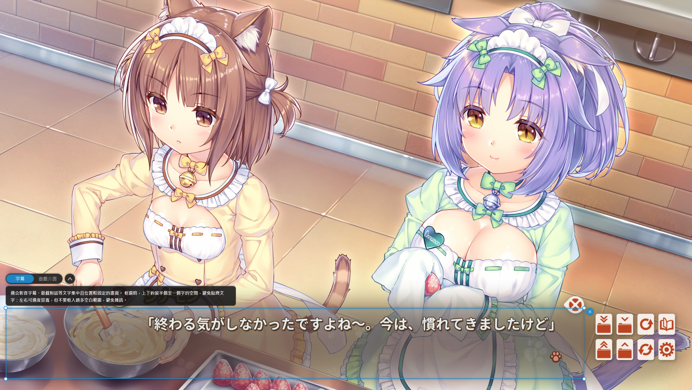

  
  <h1>OverTranslate</h1>
  
截圖翻譯、即時翻譯、譯文原位覆蓋的 Windows 螢幕翻譯工具

  

    
  

  

    
    
  

  

    <a href="https://github.com/asd880921/OverTranslate/releases/latest/download/OverTranslate-win-Setup.exe">
      <strong>➡️ Windows 安裝版（推薦）</strong>
    </a>
    &nbsp;｜&nbsp;
    <a href="https://github.com/asd880921/OverTranslate/releases/latest/download/OverTranslate-win-Portable.zip">
      <strong>➡️ 免安裝版（Portable）</strong>
    </a>
  

## 這是什麼？

**OverTranslate** 是一款專為 Windows 打造的即時螢幕翻譯工具。

支援 **截圖翻譯** 與 **即時翻譯**，可將畫面中的文字辨識翻譯後，直接顯示在原本的位置。  
無論是遊戲、PDF、影片字幕或其他無法直接選取的文字，都能快速翻譯，減少閱讀時來回切換視窗的干擾。

### 特色

- 🆓 **免費、免 API Key** — 內建多個免 API Key 的翻譯服務，安裝後即可使用
- 🎯 **截圖翻譯** — 框選畫面即可翻譯，譯文直接顯示在原本的位置
- 🎬 **即時翻譯** — 畫面內容變化時自動更新翻譯，適合影片字幕與遊戲
- 🤖 **本地 LLM** — 可搭配 Ollama 使用本地 AI 模型翻譯，也能自訂翻譯提示詞
- 🔁 **多引擎自動備援** — 首選引擎未能即時回應時自動切換，提升穩定性
- 📸 **一鍵截圖** — 框選後可直接複製原始畫面或翻譯結果，也能作為一般截圖工具使用
- 🔒 **資料安全** — OCR 全程在本機執行；使用線上翻譯服務時，僅文字辨識結果會傳送至翻譯服務
- 💾 **記憶體管理** — 依使用狀態自動載入與釋放所需模型，降低閒置時的記憶體佔用

---

## 截圖翻譯
> 可關閉翻譯主視窗 (常駐於系統匣)，在背景執行時也能隨時透過快捷鍵（預設 `Ctrl + Alt + A`）啟動截圖翻譯。  

框選想翻譯的畫面後，譯文會直接疊加顯示在原本的位置；工具列則可快速切換語言、翻譯服務、原文 / 譯文與截圖等功能。

---

## 即時翻譯
> 可使用快捷鍵（預設 `Ctrl + Alt + W`）快速開啟主視窗。

適合 **影片字幕、遊戲畫面** 等需要持續翻譯的情境。框選需要翻譯的區域後，會持續辨識畫面內容，  
文字變動時自動更新譯文並顯示在原本的位置。

> 1.目前只建議使用 Microsoft、OpenAI、DeepL 進行翻譯 (延遲較低)。  
> 2.譯文的文字顏色與背景色也可依需求調整。

### 翻譯區塊模式 (框選)
> 即時翻譯目前只支援單一螢幕，最多可同時建立 3 個翻譯區塊，且與截圖翻譯無法同時使用。

每個翻譯區塊都可以個別選擇 **字幕** 或 **遊戲介面** 模式，並依不同畫面類型使用對應的辨識方式。

**字幕**：適合影音字幕、遊戲對話等文字集中且位置較固定的畫面 (建議使用 1 個)。

| 框選 | 翻譯結果 |
|------|----------|
|  |  |
|  |  |

**遊戲介面**：適合文字分散於不同位置，或內容位置經常變動的遊戲畫面 (建議使用 1 ~ 2 個)。
> 遊戲中可使用快捷鍵（預設 Ctrl + Alt + A）暫停 / 繼續翻譯；  
> 遇到不需要翻譯的畫面時可先暫停，之後再直接恢復，不必關閉即時翻譯。

| 框選 | 翻譯結果 |
|------|----------|
|  |  |

### 浮動控制列

翻譯進行時可透過浮動控制列 **暫停** 或 **繼續翻譯**、**擷取當下翻譯的截圖**、**重新編輯翻譯區塊** 或 **結束翻譯**。

## 文字翻譯
> 可使用快捷鍵（預設 `Ctrl + Alt + W`）快速開啟主視窗。

輸入文字後即時翻譯，支援來源與目標語言互換，並可朗讀翻譯結果；截圖翻譯的結果也會同步顯示在這裡。

---

## 設定

從左側導覽列點擊 **設定**，或於系統匣圖示上按右鍵 → **設定**。所有設定變更都會自動儲存。
| 設定項目 | 說明 |
|----------|------|
| 介面語言 | 繁體中文 / English，切換後立即生效（首次啟動時依 Windows 顯示語言決定） |
| 截圖翻譯 | 用於 **截圖翻譯** 功能的快捷鍵 (可自訂修改，預設 `Ctrl + Alt + A`) |
| 開啟翻譯視窗 | 呼叫主視窗的快捷鍵 (預設 `Ctrl + Alt + W`)；即時翻譯進行時則將浮動視窗移至最上層 |
| 來源語言 | 原文 (預設 Auto) |
| 自動翻譯 | 框選完成後會 **立即自動翻譯**，不用手動點選翻譯按鈕 (預設為關閉) |
| 開機啟動 | 開機時自動啟動 |
| 翻譯服務 | 選擇使用的翻譯服務；使用 OpenAI 時，可設定 API 位址、模型名稱與翻譯提示詞 |
| 儲存截圖 | 截圖時自動儲存至本機，可自訂儲存位置（預設為關閉） |
| 主題 | 淺色 / 深色 |
| 應用紀錄 | 記錄較完整的應用程式資訊，建議僅在問題排查時開啟（預設為關閉） |

> Log 僅會保留在本機，不會自動上傳，即使開啟 **應用紀錄** 紀錄更詳細的資訊，也只會在本地儲存，需由使用者主動提供 Log 給開發者協助確認。

---

## 翻譯 API

內建多種翻譯來源，除 DeepL 外均免費、無需 API Key。
| 服務 | 說明 |
|------|------|
| Google 翻譯（RPC） | 新版 RPC 介面 |
| Google 翻譯（Web） | 傳統 Web 介面 |
| Bing 翻譯 | 翻譯品質佳 |
| Microsoft 翻譯 | **(預設)** 穩定性佳、回應速度快 |
| DeepL | 需至 DeepL 官方註冊並取得 API Key |
| OpenAI | 支援 OpenAI API 格式，建議使用本地 LLM，可透過 [Ollama](OLLAMA_GUIDE.md) 快速安裝與使用；翻譯提示詞可自訂 |

提供「自動備援」機制（備援機制適用於 **截圖翻譯** 與 **即時翻譯**）：  
當某個翻譯無法使用或回應過慢時，會自動切換到其他可用的翻譯 API，實際使用的引擎顯示於工具列。

> 若使用 **OpenAI**，則不會觸發備援機制。

## 文字轉語音（TTS）

翻譯視窗中提供文字轉語音功能，可朗讀原文或譯文，協助確認發音或聆聽內容。  
朗讀按鈕可隨時停止，或在原文與譯文間切換。  
程式會依語言自動選擇合適的語音，若目前語音無法使用，也會自動切換其他可用來源。

## 多語言 OCR 辨識

OCR 辨識由 RapidOcrNet 搭配 ONNX 模型處理，會依語言自動使用對應模型，不需手動選擇 OCR 引擎。

| 辨識語言 | 辨識模型（rec） |
|----------|----------------|
| **英文 / 中文（簡繁）/ 日文** | PP-OCRv6 通用辨識模型（`PP-OCRv6_small_rec`），單一模型支援中、英、日及多種拉丁語系，也能處理常見的中英混排 |
| **韓文** | PP-OCRv5 韓文辨識模型（`korean_PP-OCRv5_rec`），用於補足 PP-OCRv6 通用模型未涵蓋的韓文字元 |

所有語言共用同一套**文字偵測模型**（`PP-OCRv6_det_tiny`）與**方向分類模型**（`cls`），僅辨識模型會依語言切換。  
OCR 全程於本機 CPU 執行，不會將圖片上傳至外部服務。

---

## 系統需求

- **作業系統**：Windows 10 / 11
- **執行環境**：安裝檔已內含所需環境，不需另外安裝 .NET Runtime

使用以下翻譯服務時，需另外準備：

- **DeepL**：需至 [DeepL 官網](https://www.deepl.com/pro-api) 申請 API Key
- **OpenAI**：需自備 OpenAI API 相容服務，本地 LLM 架設使用方式可參考 [Ollama 安裝教學](OLLAMA_GUIDE.md)

---

## 支持

如果 OverTranslate 翻譯對你有幫助，歡迎透過 [Ko-fi](https://ko-fi.com/honlu) 請我喝杯咖啡 ~ ☕

---

## 授權

本專案採用 [GNU General Public License v3.0（GPL-3.0）](https://www.gnu.org/licenses/gpl-3.0.html) 授權。  
你可以自由使用、修改與散布本軟體；若散布修改後的版本，需依 GPL-3.0 授權條款公開相應的原始碼。  
完整授權條款請參閱 [LICENSE](LICENSE)。

