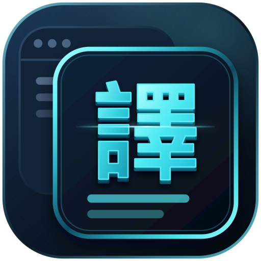

  

    🌐
    <strong><a href="README.en.md">English</a></strong>
    &nbsp;｜&nbsp;
    <strong><a href="../README.md">繁體中文</a></strong>
    &nbsp;｜&nbsp;
    <strong><a href="README.zh-Hans.md">简体中文</a></strong>
    &nbsp;｜&nbsp;
    <strong><a href="README.ja.md">日本語</a></strong>
    &nbsp;｜&nbsp;
    <strong>한국어 ✓</strong>
  

  <h1>
    
     
    OverTranslate
  </h1>
  
캡처·실시간·빠른 조회·빠른 번역을 지원하는 Windows 화면 번역 도구. 번역 결과를 원래 화면 위에 그대로 보여 줍니다.

  

    
    
  

  

    
    &nbsp;
    
  

  

    
  

---

## 번역 기능

OverTranslate은 다섯 가지 번역 기능을 제공하며, 상황에 맞는 것을 바로 고를 수 있습니다.

- **[캡처 번역](#캡처-번역)** — 화면의 영역을 지정하면 글자를 인식해 번역문을 그 자리에 겹쳐 보여 줍니다
- **[실시간 번역](#실시간-번역)** — 영상이나 게임 화면의 지정한 영역을 계속 번역해 원래 위치에 표시합니다
- **[빠른 조회](#빠른-조회)** — 텍스트를 선택하면 작은 번역 창이 열리며, 고정해 계속 띄워 둘 수도 있습니다
- **[빠른 번역](#빠른-번역)** — 텍스트를 선택하고 단축키를 누르면 그 자리에서 번역문으로 바뀝니다
- **[텍스트 번역](#텍스트-번역)** — 입력, 언어 바꾸기, 읽어 주기를 지원하는 전체 번역 창입니다

---

## 캡처 번역

**메인 창을 닫고 시스템 트레이에 상주할 수 있어서** 평소에 창을 계속 띄워 둘 필요가 없습니다.  
번역이 필요할 때 단축키(기본 Ctrl + Alt + A)를 누르고 번역할 영역을 지정하면 됩니다.
> 웹 페이지, PDF, 이미지, 영상, 게임 화면처럼 글자를 직접 선택할 수 없는 화면에서 쓸 수 있습니다.

| 원문 | 번역 결과 |
|------|----------|
|  |  |
|  |  |
|  |  |

---

## 실시간 번역

**영상 자막이나 게임 화면**처럼 계속 번역해야 하는 상황에 적합합니다. 번역할 영역을 지정하면 화면 내용을 계속 인식하고,  
글자가 바뀔 때마다 번역문을 갱신해 원래 위치에 표시합니다.

가져오기 방식은 **전체 화면** 과 **창 지정** 두 가지입니다.  
전체 화면은 Windows 11 24H2 이상, 창 지정은 Windows 10 1903 이상이 필요합니다.

> 지연이 적은 Microsoft, DeepL, OpenAI 사용을 권장합니다.  

> 번역문의 글자 색, 배경 색, 배경 불투명도를 자유롭게 조정할 수 있습니다. **배경에 자연스럽게 맞추기** 와 **원문 글자 색 사용** 을 켜면 번역문이 원래 화면의 색감에 더 잘 어울립니다.

### 번역 블록 모드(영역 선택)

> 실시간 번역 중에는 단축키(기본 Ctrl + Alt + S)로 일시 정지·재개할 수 있습니다.  
> 번역이 필요 없는 장면이거나 원문을 그대로 보고 싶을 때 잠시 멈췄다가 다시 시작하면 되므로, 실시간 번역을 종료할 필요가 없습니다.

번역 블록에는 **자막 / 대사** 와 **게임 / UI** 두 가지 모드가 있습니다.
**자막 / 대사**: 영상 자막이나 게임 대사처럼 글자 위치가 일정한 장면에 적합합니다(1개 권장).

| 영역 선택 | 번역 결과 |
|------|----------|
|  |  |
|  |  |
|  |  |

**게임 / UI**: 게임의 메뉴나 안내처럼 글자가 흩어져 있고 위치가 일정하지 않은 장면에 적합합니다(1 ~ 2개 권장).

| 영역 선택 | 번역 결과 |
|------|----------|
|  |  |

---

## 빠른 조회
> 단축키(기본 `Ctrl + Alt + Q`)로 어느 화면에서든 바로 열 수 있습니다.

텍스트를 선택하고 단축키를 누르면 자동으로 불러와 번역합니다. 아무것도 선택하지 않았다면 직접 입력할 수도 있습니다.  
다른 창으로 전환하면 닫히며, 계속 띄워 두려면 창을 고정하세요.

---

## 빠른 번역
> 단축키(기본 `Ctrl + Alt + E`). 번역할 때 창이 열리지 않습니다.

텍스트를 선택하고 단축키를 누르면 번역 결과가 그대로 붙여넣어져 원문을 대체합니다(글자를 입력할 수 있는 칸에서만 동작하며, 입력란이 아니면 붙여넣을 수 없습니다).

---

## 텍스트 번역

**입력하면 바로 번역**되고, 원본 언어와 번역할 언어를 빠르게 바꿀 수 있습니다.  
음성 합성(TTS)을 내장해 원문과 번역문 모두 읽어 줍니다.

---

## 설정

| 설정 항목 | 설명 |
|----------|------|
| 인터페이스 언어 | 繁體中文 / 简体中文 / English / 日本語 / 한국어. 바꾸면 곧바로 반영됩니다(첫 실행 시에는 Windows 표시 언어를 따릅니다) |
| 캡처 번역(단축키) | **캡처 번역** 을 시작하는 단축키(변경 가능, 기본 `Ctrl + Alt + A`) |
| 번역 창 열기(단축키) | 메인 창을 마지막에 보던 페이지로 불러옵니다(기본 `Ctrl + Alt + W`). 실시간 번역 중에는 플로팅 바를 맨 앞으로 옮깁니다 |
| 일시 정지 / 재개(단축키) | **실시간 번역** 을 일시 정지·재개합니다(기본 `Ctrl + Alt + S`). 실시간 번역 중에만 쓸 수 있고, 원문을 확인할 때 유용합니다 |
| 빠른 조회(단축키) | **빠른 조회** 창을 엽니다(기본 `Ctrl + Alt + Q`). 텍스트를 선택해 두었다면 자동으로 불러와 번역합니다 |
| 빠른 번역(단축키) | 선택한 텍스트를 번역 결과로 바꿉니다(기본 `Ctrl + Alt + E`). 아무것도 선택하지 않았다면 아무 일도 일어나지 않습니다 |
| 자동 번역 | **캡처 번역** 에서 영역을 다 지정하면 **곧바로 번역** 해, 따로 누를 필요가 없습니다(기본은 꺼짐) |
| 시작 프로그램 | Windows 시작 시 자동으로 실행합니다 |
| 스크린샷 저장 | 캡처할 때마다 내 PC에 자동으로 저장하며, 저장 위치를 지정할 수 있습니다(기본은 꺼짐) |
| 원본 언어 | **캡처 번역** 과 **텍스트 번역** 의 원문 언어(기본 Auto). 실시간 번역의 원본 언어는 따로 설정합니다 |
| 번역 서비스 설정 | 키나 엔드포인트가 필요한 서비스를 설정합니다. OpenAI에서는 API 주소, 모델 이름, 프롬프트, Temperature를 설정할 수 있습니다 |
| 테마 | 라이트 / 다크 |
| 앱 로그 | 앱의 정보를 더 자세히 기록합니다. 문제를 확인할 때만 켜는 것을 권장합니다(기본은 꺼짐) |

> 단축키는 조합키뿐 아니라 단독 키로도 지정할 수 있습니다. F1 ~ F12, 마우스 가운데／옆 버튼, 게임패드 버튼을 쓸 수 있습니다.

> 로그는 내 PC에만 저장되며 자동으로 전송되지 않습니다. **앱 로그** 를 켰을 때 기록되는 자세한 정보도 마찬가지로 PC 안에만 남습니다.  
> 문제를 신고할 때는 설정 페이지에서 **진단 정보 내보내기 및 업로드** 를 누르세요. 업로드가 바로 끝나고 신고 코드가 표시됩니다(개발자에게 알려 주면 빠르게 대조할 수 있습니다).

---

### 번역 API

> DeepL과 OpenAI를 제외하면, 내려받은 뒤 바로 사용할 수 있습니다.

| 서비스 | 설명 |
|------|------|
| Google 번역(RPC) | 새 RPC 인터페이스 |
| Google 번역(Web) | 기존 웹 인터페이스 |
| Bing 번역 | 번역 품질이 좋음 |
| Microsoft 번역 | **(기본)** 안정적이고 응답이 빠름 |
| DeepL | DeepL 공식 사이트에서 가입해 API 키를 받아야 합니다 |
| OpenAI | OpenAI API 호환 형식을 지원합니다. 로컬 LLM 사용을 권장하며 [Ollama](guides/OLLAMA_GUIDE.ko.md)로 간편하게 설치할 수 있습니다. 프롬프트와 Temperature는 바꿀 수 있습니다 |
  
**자동 백업** 기능이 있습니다(**캡처 번역** 과 **실시간 번역** 에 적용됩니다).  
어떤 서비스를 쓸 수 없거나 응답이 느리면 사용할 수 있는 다른 번역 API로 자동 전환되며, 실제로 사용한 엔진이 도구 모음에 표시됩니다.

> **OpenAI** 를 사용할 때는 백업으로 전환되지 않습니다.

### OpenAI 설정

| 항목 | 설명 |
|------|------|
| API 주소 | 비워 두면 `http://localhost:11434/v1`(Ollama의 로컬 기본 주소)를 사용합니다 |
| 모델 이름 | 비워 두면 `translategemma:4b`를 사용합니다 |
| 프롬프트 | 비워 두면 기본 프롬프트를 사용합니다. 아래 매개변수로 그때 사용하는 언어를 넣을 수 있습니다 |
| Temperature | **고급** 에 있습니다. 출력이 얼마나 달라지는지에 영향을 주며, 범위는 0.0 ~ 2.0(기본 0) |

프롬프트에서 사용할 수 있는 매개변수(설정 페이지의 **사용할 수 있는 매개변수** 에도 설명과 예가 있습니다):

| 매개변수 | 설명 | 예 |
|------|------|------|
| `{source_name}` | 원본 언어 이름 | 영어 |
| `{source_code}` | 원본 언어 코드 | en |
| `{target_name}` | 번역할 언어 이름 | 일본어 |
| `{target_code}` | 번역할 언어 코드 | ja |

> 기본 프롬프트는 언어 이름만 사용합니다. 언어 코드 매개변수는 모델에 맞춰 조합해 쓰면 됩니다. 예: `{target_name} (target_code)` -> `Japanese (ja)`.
> 
> Temperature 체크를 해제하면 **이 매개변수를 보내지 않습니다**. 지원 여부와 권장값은 모델이나 API마다 다르므로, 모델 문서에서 보내지 말라고 안내한다면 체크를 해제하세요. 0에서 출력이 이상하면 모델의 권장에 따라 올려 보세요. 0.1부터 조금씩 조정하는 것을 권장합니다.

### 다국어 OCR 인식

OCR 인식은 RapidOcrNet과 ONNX 모델로 처리하며, 언어에 따라 알맞은 모델이 자동으로 사용됩니다. OCR 엔진을 직접 고를 필요는 없습니다.

| 인식 언어 | 인식 모델(rec) |
|----------|----------------|
| **영어 / 중국어(간체·번체) / 일본어** | PP-OCRv6 범용 인식 모델(`PP-OCRv6_small_rec`). 하나의 모델로 중국어·영어·일본어와 여러 라틴 문자를 지원하며, 흔한 중영 혼용도 처리합니다 |
| **한국어** | PP-OCRv5 한국어 인식 모델(`korean_PP-OCRv5_rec`). PP-OCRv6 범용 모델이 다루지 않는 한글을 보완합니다 |

**문자 검출 모델**(`PP-OCRv6_det_tiny`)과 **방향 분류 모델**(`cls`)은 모든 언어가 공유하며, 언어에 따라 바뀌는 것은 인식 모델뿐입니다.  
OCR은 처음부터 끝까지 내 PC의 CPU에서 실행되며, 이미지를 외부 서비스로 보내지 않습니다.

---

## 시스템 요구 사항

- **운영체제**: Windows 10 / 11
- **실행 환경**: 필요한 구성 요소가 설치 파일에 포함되어 있어 .NET 런타임을 따로 설치할 필요가 없습니다

다음 번역 서비스를 사용하려면 별도로 준비해야 합니다.

- **DeepL**: [DeepL 공식 사이트](https://www.deepl.com/pro-api)에서 API 키를 발급받으세요
- **OpenAI**: OpenAI API 호환 서비스를 직접 준비해야 합니다. 로컬 LLM 구축 방법은 [Ollama 설치 안내](guides/OLLAMA_GUIDE.ko.md)를 참고하세요

---

## 후원

이 소프트웨어가 일상이나 업무에 도움이 되었다면 [Ko-fi](https://ko-fi.com/honlu)에서 커피 한 잔 사 주셔도 좋습니다 ~ ☕

---

## 라이선스

이 프로젝트는 [GNU General Public License v3.0(GPL-3.0)](https://www.gnu.org/licenses/gpl-3.0.html)을 따릅니다.  
자유롭게 사용·수정·배포할 수 있으며, 수정한 버전을 배포할 때는 GPL-3.0에 따라 해당 소스 코드를 공개해야 합니다.  
전문은 [LICENSE](../LICENSE)에서 확인할 수 있습니다.
