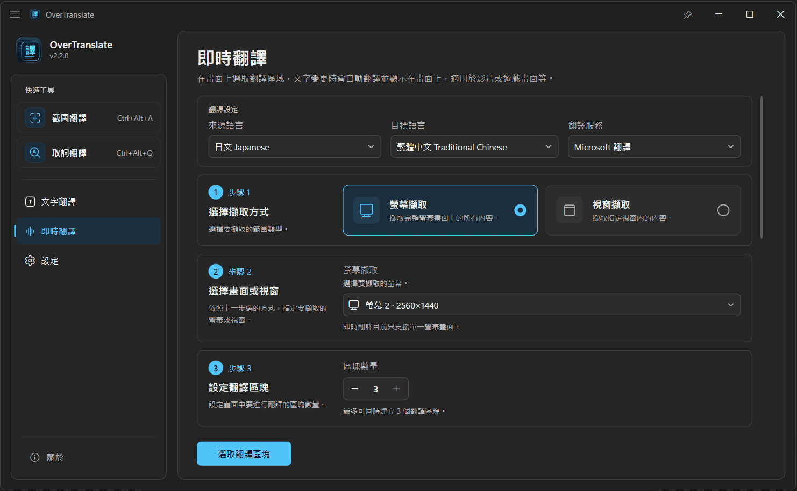
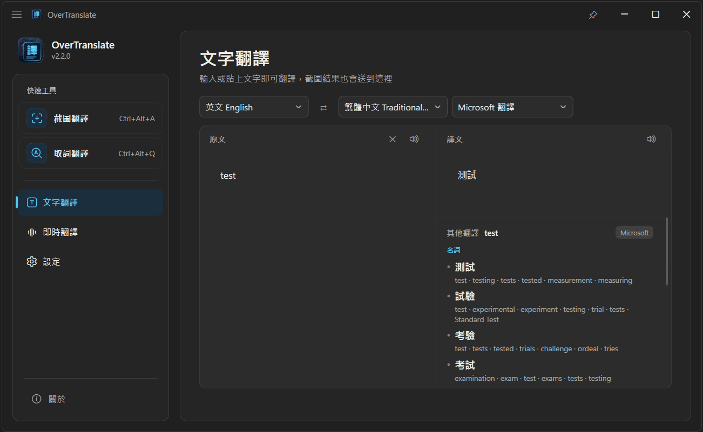
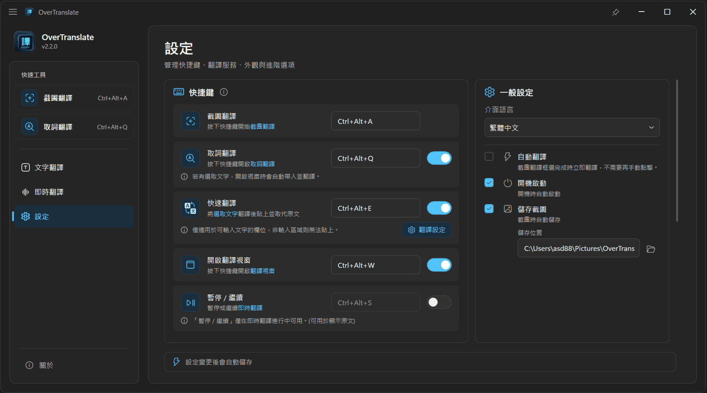

  

    🌐
    <strong><a href="README.en.md">English</a></strong>
    &nbsp;｜&nbsp;
    <strong><a href="../README.md">繁體中文</a></strong>
    &nbsp;｜&nbsp;
    <strong>简体中文 ✓</strong>
    &nbsp;｜&nbsp;
    <strong><a href="README.ja.md">日本語</a></strong>
    &nbsp;｜&nbsp;
    <strong><a href="README.ko.md">한국어</a></strong>
  

  <h1>
    
     
    OverTranslate
  </h1>
  
一款 Windows 屏幕翻译工具，支持截图、实时、取词与快速翻译，翻译结果直接显示在原画面上。

  

    
    
  

  

    
    &nbsp;
    
  

  

    
  

---

## 翻译功能

OverTranslate 目前提供了五种翻译功能，可依不同使用场景快速选择：

- **[截图翻译](#截图翻译)** — 框选画面内容，识别并将译文直接显示在原画面
- **[实时翻译](#实时翻译)** — 实时翻译视频 / 游戏画面指定区域，并将译文显示在原画面上
- **[取词翻译](#取词翻译)** — 选取文字后打开精简翻译小窗口，也可固定常驻使用
- **[快速翻译](#快速翻译)** — 选取文字后按下快捷键，直接翻译并替换原文
- **[文字翻译](#文字翻译)** — 使用完整翻译窗口，支持文字输入、语言互换与文字朗读

---

## 截图翻译

**程序可以直接关闭主窗口并常驻在系统托盘**，平常不需要一直把窗口开着，  
需要翻译时按下快捷键（默认 Ctrl + Alt + A），框选想翻译的画面即可。
> 用于网页、PDF、图片、影音、游戏界面等各种无法直接选取文字的画面。

| 原文 | 翻译结果 |
|------|----------|
|  |  |
|  |  |
|  |  |

---

## 实时翻译

适合 **视频字幕、游戏画面** 等需要持续翻译的场景。框选需要翻译的区域后，会持续识别画面内容，  
文字变化时自动更新译文并显示在原本的位置。

画面来源分为 **屏幕捕获** 与 **窗口捕获** 两种模式：  
屏幕捕获需 Windows 11 24H2 以上，窗口捕获需 Windows 10 1903 以上。

> 目前只建议使用 Microsoft、DeepL、OpenAI 进行翻译（延迟较低）。  

> 译文的文字颜色、背景色与背景不透明度皆可自由调整，也可开启 **更贴合原背景** 与 **沿用原文字颜色**，让译文与背景更贴近原画面的配色与风格。

### 翻译区块模式（框选）

> 实时翻译进行中可使用快捷键（默认 Ctrl + Alt + S）暂停 / 继续翻译，  
> 遇到不需要翻译的画面、或想直接看原文时可先暂停，之后再恢复，不必关闭实时翻译。

翻译区块分为 **字幕 / 对话** 或 **游戏 / UI** 模式：
**字幕 / 对话**：适合影音字幕、游戏对话等文字位置较集中且固定的场景（建议使用 1 个）。

| 框选 | 翻译结果 |
|------|----------|
|  |  |
|  |  |
|  |  |

**游戏 / UI**：适合游戏中的界面、提示或文字位置较分散、不固定的场景（建议使用 1 ~ 2 个）。

| 框选 | 翻译结果 |
|------|----------|
|  |  |

---

## 取词翻译
> 快捷键（默认 `Ctrl + Alt + Q`）可在任何画面上直接打开。

选取文字后按下快捷键，会自动带入并翻译；未选取文字时，也可以直接输入内容。  
切换到其他窗口时会自动关闭；若需要持续显示，可将窗口固定。

---

## 快速翻译
> 快捷键（默认 `Ctrl + Alt + E`），使用翻译时不会打开任何窗口。

选取文字后按下快捷键，翻译结果会直接粘贴替换原文（仅适用于可输入文字的字段，非输入区域则无法粘贴）。

---

## 文字翻译

**输入文字后即可翻译**，源语言与目标语言可快速互换；  
内置文字转语音（TTS），支持朗读原文与翻译结果。

---

## 设置

| 设置项 | 说明 |
|----------|------|
| 界面语言 | 繁體中文 / 简体中文 / English / 日本語 / 한국어，切换后立即生效（首次启动时依 Windows 显示语言决定） |
| 截图翻译（快捷键） | 用于 **截图翻译** 功能的快捷键（可自定义修改，默认 `Ctrl + Alt + A`） |
| 打开翻译窗口（快捷键） | 呼出主窗口的快捷键（默认 `Ctrl + Alt + W`），会回到上次打开的页面；实时翻译进行中时，改为将浮动窗口栏移到最上层 |
| 暂停 / 继续（快捷键） | 暂停或继续 **实时翻译**（默认 `Ctrl + Alt + S`）；仅在实时翻译进行中可用，也可用于查看原文 |
| 取词翻译（快捷键） | 打开 **取词翻译** 窗口（默认 `Ctrl + Alt + Q`）；若已选中文字会自动带入并翻译 |
| 快速翻译（快捷键） | 直接将选中的文字替换为翻译结果（默认 `Ctrl + Alt + E`）；未选中文字时不会有任何动作 |
| 自动翻译 | **截图翻译** 框选完成后 **立即翻译**，不需要再手动点击（默认为关闭） |
| 开机启动 | 开机时自动启动 |
| 保存截图 | 截图时自动保存至本机，可自定义保存位置（默认为关闭） |
| 源语言 | **截图翻译** 与 **文字翻译** 的原文语言（默认 Auto）；实时翻译的源语言另外设置 |
| 翻译服务设置 | 为需要密钥或端点的翻译服务进行设置；使用 OpenAI 时，可设置 API 地址、模型名称、翻译提示词与 Temperature |
| 主题 | 浅色 / 深色 |
| 应用日志 | 记录较完整的应用程序信息，建议仅在排查问题时开启（默认为关闭） |

> 快捷键除了组合键，也可以设成单个按键，包含 F1 ~ F12、鼠标中键/侧键与游戏手柄按键。

> 日志仅保存在本机，不会自动上传；开启 **应用日志** 后的详细信息同样只会保留在本机。  
> 反馈问题时，可在设置页按下 **导出并上传诊断信息**，系统会直接完成上传，并取得一组反馈代码（可提供给开发者快速比对问题）。

---

### 翻译 API

> 除了 DeepL 与 OpenAI 以外，其他都是下载后就可以直接使用的功能。

| 服务 | 说明 |
|------|------|
| Google 翻译（RPC） | 新版 RPC 接口 |
| Google 翻译（Web） | 传统 Web 接口 |
| Bing 翻译 | 翻译质量佳 |
| Microsoft 翻译 | **（默认）** 稳定性佳、响应速度快 |
| DeepL | 需到 DeepL 官方注册并获取 API Key |
| OpenAI | 支持 OpenAI API 格式，建议使用本地 LLM，可通过 [Ollama](guides/OLLAMA_GUIDE.zh-Hans.md) 快速安装与使用；提示词与 Temperature 可自定义 |
  
提供「自动备用」机制（备用机制适用于 **截图翻译** 与 **实时翻译**）：  
当某个翻译无法使用或响应过慢时，会自动切换到其他可用的翻译 API，实际使用的引擎显示于工具栏。

> 使用 **OpenAI** 时，不会触发备用机制。

### OpenAI 设置

| 项目 | 说明 |
|------|------|
| API 地址 | 留空时使用 `http://localhost:11434/v1`（Ollama 的本机默认地址） |
| 模型名称 | 留空时使用 `translategemma:4b` |
| 提示词 | 留空时使用内置提示词；可用下方参数代入实际使用的语言 |
| Temperature | 位于 **高级** 区，影响输出的随机程度，范围 0.0 ~ 2.0（默认 0） |

提示词可用参数（设置页的 **可用参数** 区块也会列出说明与示例）：

| 参数 | 说明 | 示例 |
|------|------|------|
| `{source_name}` | 源语言名称 | 英语 |
| `{source_code}` | 源语言代码 | en |
| `{target_name}` | 目标语言名称 | 日语 |
| `{target_code}` | 目标语言代码 | ja |

> 内置提示词仅使用语言名称；语言代码参数可依模型需求自行搭配使用，例如 `{target_name} (target_code)` -> `Japanese (ja)`。
> 
> Temperature 取消勾选时 **不会发送此参数**。不同模型或 API 对 Temperature 的支持与建议值可能不同；若模型文档建议不要发送此参数，请取消勾选。若在 0 时输出表现异常，可依模型建议尝试调高，建议从 0.1 开始逐步调整。

### 多语言 OCR 识别

OCR 识别由 RapidOcrNet 搭配 ONNX 模型处理，会依语言自动使用对应模型，不需手动选择 OCR 引擎。

| 识别语言 | 识别模型（rec） |
|----------|----------------|
| **英文 / 中文（简繁）/ 日文** | PP-OCRv6 通用识别模型（`PP-OCRv6_small_rec`），单一模型支持中、英、日及多种拉丁语系，也能处理常见的中英混排 |
| **韩文** | PP-OCRv5 韩文识别模型（`korean_PP-OCRv5_rec`），用于补足 PP-OCRv6 通用模型未涵盖的韩文字符 |

所有语言共用同一套**文字检测模型**（`PP-OCRv6_det_tiny`）与**方向分类模型**（`cls`），仅识别模型会依语言切换。  
OCR 全程于本机 CPU 执行，不会将图片上传至外部服务。

---

## 系统需求

- **操作系统**：Windows 10 / 11
- **运行环境**：安装文件已内含所需环境，不需另外安装 .NET Runtime

使用以下翻译服务时，需另外准备：

- **DeepL**：需到 [DeepL 官网](https://www.deepl.com/pro-api) 申请 API Key
- **OpenAI**：需自备 OpenAI API 兼容服务，本地 LLM 搭建使用方式可参考 [Ollama 安装教程](guides/OLLAMA_GUIDE.zh-Hans.md)

---

## 支持

本软件若对你日常或工作使用上有帮助，欢迎通过 [Ko-fi](https://ko-fi.com/honlu) 请我喝杯咖啡 ~ ☕

---

## 许可

本项目采用 [GNU General Public License v3.0（GPL-3.0）](https://www.gnu.org/licenses/gpl-3.0.html) 许可。  
你可以自由使用、修改与分发本软件；若分发修改后的版本，需依 GPL-3.0 许可条款公开相应的源代码。  
完整许可条款请参阅 [LICENSE](../LICENSE)。
